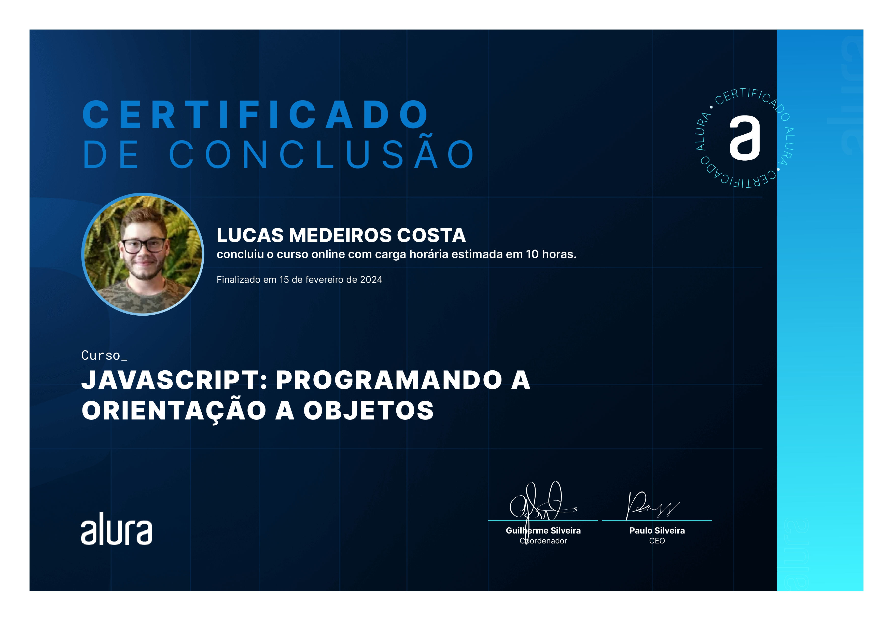

# Java Script: Programming Object Orientation

This project was developed as part of the Alura course to learn and practice JavaScript development.

# Visualization



- **JavaScript: Exploring The Language** [JavaScript] by Alura
- **Instructor:** [Ricardo] [Linkedin](https://www.linkedin.com/in/ricardo-bugan-b0581379/)
- **Platform:** [Alura's Platform]
- **Course Link:** [Link](https://cursos.alura.com.br/course/javascritpt-orientacao-objetos)

## Getting Started

To run this project locally, follow these steps:

1. **Clone the repository:**

   ```sh
   git clone [https://github.com/LucasMdct/Alura.git]
   cd JavaScript / cd JS-programming-object-orientation

2. **Run the App:**
   - Start
   ```sh
    node index.js
   ```

## Contact

Developed by [Lucas Medeiros]
If you have any questions, suggestions or problems, please feel free to contact us at [lucasmedeiroscosta07@gmail.com](mailto:lucasmedeiroscosta07@gmail.com).