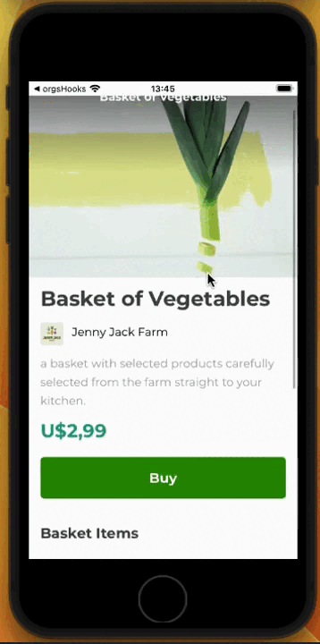

# Orgs-Cesta: Visualization

# Orgs-Cesta: Application Documentary

Orgs-Cesta is an application that aims to simplify the management of food baskets for non-profit organizations. This application so far is only front-end.

We created some reusable components; we create and use components from React Native itself, such as FlatList, StyleSheet and View.
ß
we also use Text in MyText. We use Image to display images. We used SafeAreaView to create that safe area, so we can run on both Android and iOS, we styled it so that all the things on the screen look nice.

We also work with external libraries, such as fonts. We use @expo-google-fonts, we use expo-splash-screen to make the app wait and stay on the loading screen while this font loads.

We learned how to make a list - and not just a list, an optimized list so that it only loads the items that are showing on the screen and doesn't crash our device.

using Expo-cli we need to install XCode in my case, because I use mac, which normally needs to work with React Native CLI, with the pure React Native command line.

## Installation

Follow these steps to configure and run the project locally:

1. Clone this repository: `git clone https://github.com/LucasMdct/Alura.git `

2. Access the project directory: `cd ReactNative` \ `cd react_native_zero` \ `cd orgs-basket`

3. Install the dependencies: `npm install` 

4. Run the application: `npm start`

## Contact

If you have any questions, suggestions or problems, please feel free to contact us at [lucasmedeiroscosta07@gmail.com](mailto:lucasmedeiroscosta07@gmail.com).